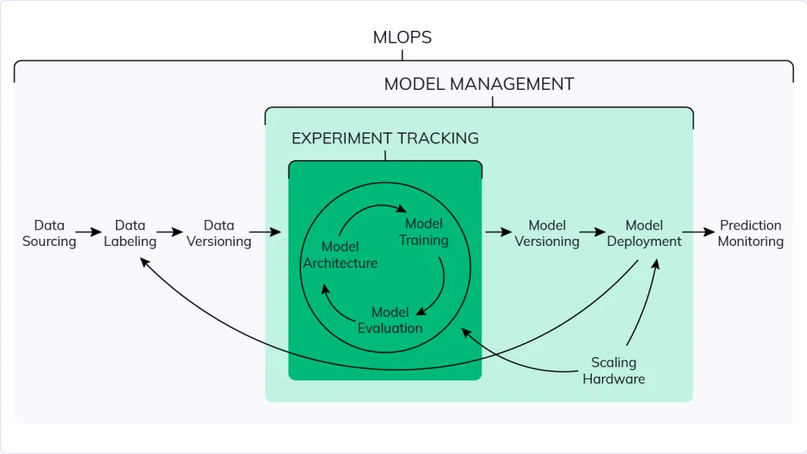

# Experiment tracking

## important concepts

ml experiment = process of building a model
experiment run = each trial in an ml experiment
run artifact = any file that is associateed with an ml run

## what is experiment tracking?

- process of keeping track of all relevant info from an ml experiment

ex: source code, env, data, model, hyperparams, metrics

## why is it important

1. reproducability - so anyone can run it
2. organization - so anyone can understand it
3. optimization - so it's fast

## Why not just track in spreadsheets?

- error prone
- no standard format
- lack of visibility and collaboration

## Solution: MLFlow

A python package for machine learning lifecycle

4 main modules

- tracking
- models
- model registry
- projects

## Ml Flow tracking

ML flow organizes experiments into runs, keeping track of

- parameters : data files
- metrics : accuracy, f1, etc.
- metadata : tags of models
- artifacts : any file associated with run, could be a visualization
- models : lock models

Also logs extra information automatically

- source code
- version of code
- start and end time
- author

## Model management

## model registrty

- track stage of model and have access to all versions
- not going to deploy models for you, only labels models for staging, production or archieve
- you need CI/CD code to deploy models
