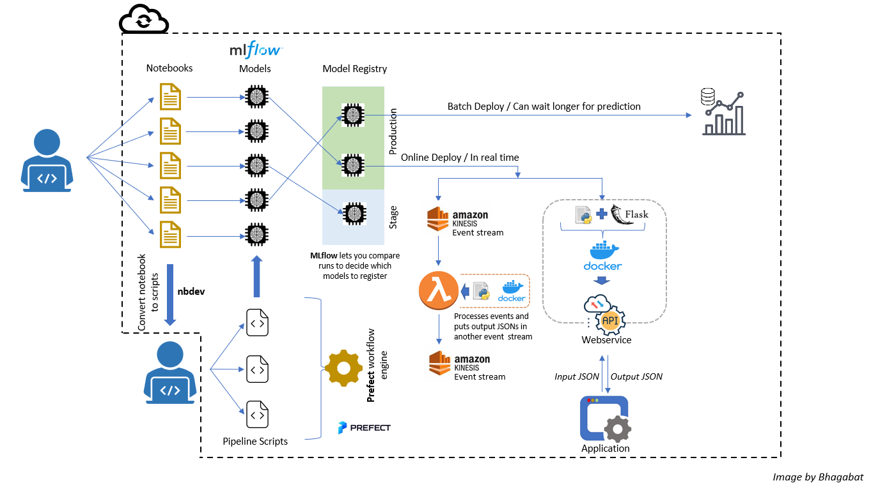
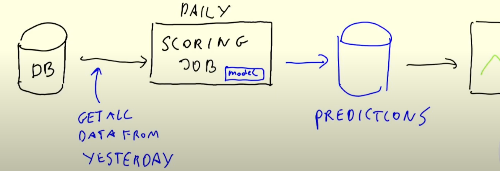
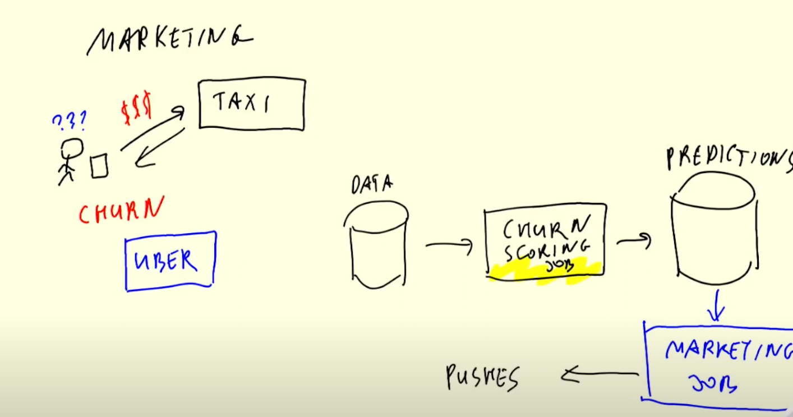
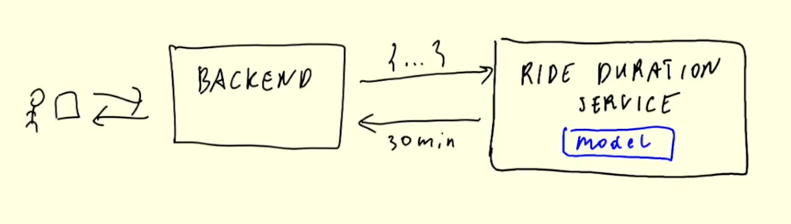
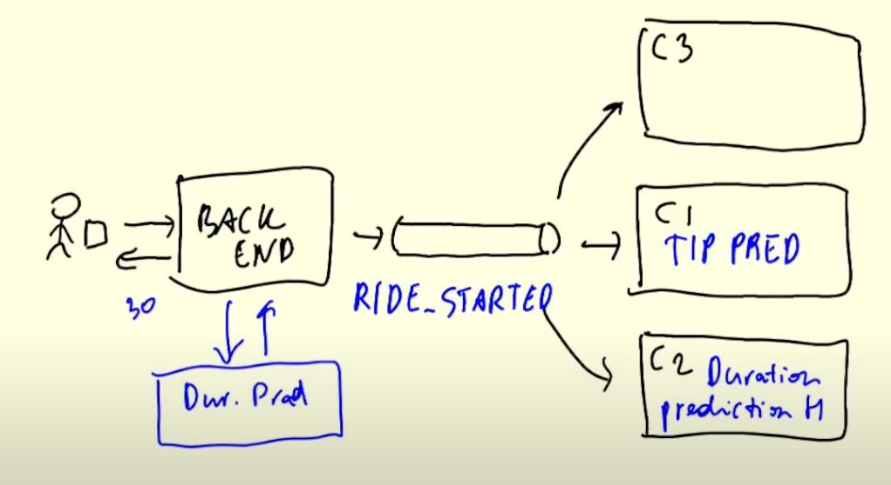
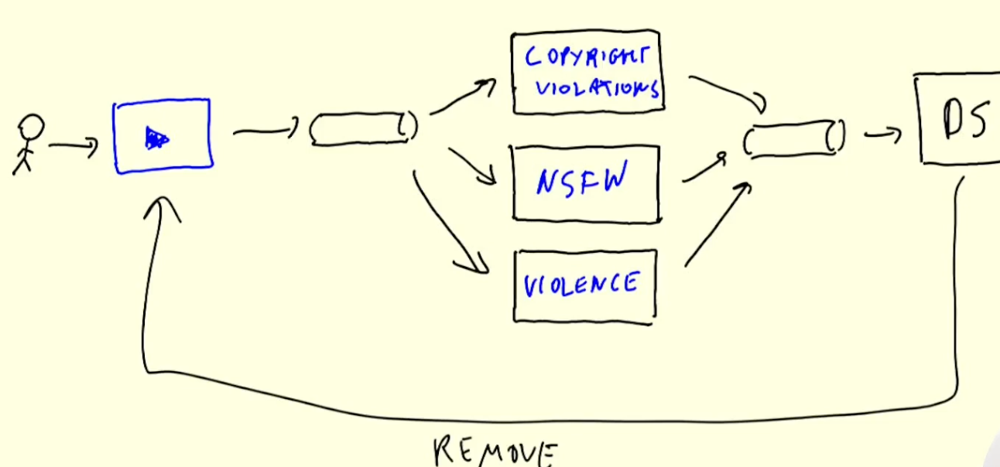

# Deployment

- [Deployment](#deployment)
  - [2 deployment paradigms](#2-deployment-paradigms)
    - [1. offline (batch)](#1-offline-batch)
      - [batch](#batch)
    - [2. online (web service and streaming)](#2-online-web-service-and-streaming)
      - [web services](#web-services)
      - [streaming](#streaming)

## 2 deployment paradigms

### 1. offline (batch)

#### batch

- run mode regularly (hourly, daily, monthly, etc.)

use case : churn prediction

### 2. online (web service and streaming)

#### web services

- needs to be online 24/7
- Backend sends data to the model and the model replies back with the predicted duration
- 1 to 1 relationship betwen client and model

use case : ride duration service

#### streaming

- producers (backend) and consumers
  - producer pushes data into data stream
  - consumers take data and make predictions
- one to many relationship between client and models

use case: content moderation

difference between web service and streaming

- in streaming, backend sends data to consumers and then there is no between producer and consumer
